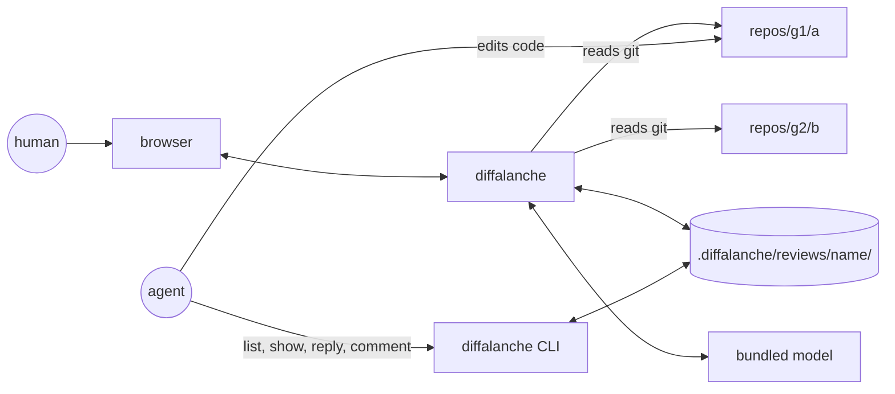

# diffalanche — product specification

Status: approved requirements, amended alongside the code that implements them. Phase 1 shipped as v0.1.0 on 2026-09-05; its findings are closed from the backlog; Phase 2 has started (DA-33). Owner: Velklish. License: MIT.

## 1. Purpose

diffalanche is a local code-review tool for a folder that contains many independent git repositories. It shows the changes of every repository under one root as a single merge-request-style review, stores review comments on disk as plain JSON, and gives coding agents a CLI to read comments, reply to them, and open their own. It also suggests comments from the reviewer's own history, using a small model that ships with the tool.

The primary user reviews work produced by coding agents across several repositories at once. The agent reads the review from disk, fixes the code, and answers in the comment threads. The human closes what is verified.

## 2. Landscape

| Tool | Repositories per session | Comment storage | Hand-off to agent |
|---|---|---|---|
| difit | one | browser localStorage | clipboard ("Copy Prompt"), `--comment` preload |
| diffity | one per instance | not specified | `/diffity-resolve` skill; PolyForm Shield license |
| diffx | one | server process memory | agent fetches over HTTP API while the server runs |
| difftray | many | not specified | clipboard prompt; macOS Electron app |

None of them combines many repositories in one review with on-disk comments and a CLI. That combination is the product.

## 3. Decisions

1. **Name and home.** `diffalanche`, `github.com/Velklish/diffalanche`, public from the first commit, MIT.
2. **Stack and delivery.** TypeScript. Bun is the toolchain (dev, test, bundling, single-file executables). Server code uses only APIs shared by Node and Bun. Two delivery channels: npm (`npx diffalanche`, Node >= 22) and prebuilt binaries for macOS, Linux, and Windows on x64 and arm64. UI in React. Diff parsing, rendering, and syntax highlighting come from an existing library (`@git-diff-view/react`, fallback `react-diff-view`); the project does not write its own.
3. **Root and repositories.** The root is the directory diffalanche runs in; `--root` overrides it. A repository is any directory containing `.git` (a directory or a worktree file) found at most `depth` levels below each entry of `roots`. A found repository is not scanned inside, so nested submodules and worktrees under it are not listed. A repository is identified by its path relative to the root — including the `roots` entry it was found under, so with `roots: ["repos"]` the id is `repos/group/service-api`, and with the default `roots: ["."]` it is `group/service-api`.
4. **Diff base.** Three modes. A review session has one mode; the tool applies it to every repository separately. `head`: working tree against HEAD. `branch`: working tree against the merge base of HEAD and a branch — the remote default branch unless the session names one (`base.branch`, for example `origin/develop`); a repository where the named branch does not resolve uses its remote default branch with a warning; without a remote it behaves like `head`. `ref`: an explicit ref; repositories where it does not resolve are skipped with a warning. Untracked files are part of the diff. The tool reads git and never changes a repository's index, working tree, or history.
5. **Storage.** `<root>/.diffalanche/`, overridable with `--data-dir` for one command, or for good with `DIFFALANCHE_DATA_DIR` or `dataDir` in the user config `$XDG_CONFIG_HOME/diffalanche/config.json` (`~/.config` without the variable); flag over variable over file over default, and everything but the flag relative to the root. One review session is one directory with three JSON files: session metadata, comments, and a cache of the last scanned diff. Metadata and comments are readable and editable by hand; the diff cache is written only by the tool. Sessions are never deleted automatically. Concurrent writes from the UI and the CLI lose no data.
6. **Comment anchors.** A comment attaches to a line, a line range, a file, a repository, or the whole review. A line comment stores the line text and surrounding context, which is the input for re-anchoring in Phase 3.
7. **Severity.** `critical | warning | nit | question`.
8. **Status and roles.** `open | resolved`; Phase 3 adds `orphaned`. A human opens comments; from the MVP on, agents can open them too through the CLI. An agent answers inside the thread in at most three sentences: one when it fixed the issue, three when it declines. Only a human sets `resolved`: the CLI refuses `resolve` and `reopen` unless the caller passes `--role human`. Every message carries `author` and `role: human | agent`.
9. **Agent interface.** The CLI is the only contract for agent skills. The HTTP API exists for the UI and is not a contract. The JSON files remain a second way to read the data.
10. **Suggestions from history.** A multilingual embedding model ships with the tool (118M parameters, about 120 MB in int8) and works offline with nothing to install. It runs in the server process, so suggestions are available from the CLI as well. The binary embeds the model and the runtime's native files; the npm package downloads both into the user cache on first use. Intel Macs (darwin-x64) get no model, so suggestions are not available there. The model, its runtime and the delivery are decided in [ADR-014](adr/adr-014-embedding-model-and-npm-delivery.md). A generative 0.5B model (about 400 MB quantized) is downloaded on demand with `model pull`. There is no fine-tuning: "in your style" comes from retrieving similar past comments and using them as examples.
11. **Code navigation for any language.** Three tiers. Tier 1: text search and symbol-by-name search — any language, across repositories, no dependencies. Tier 2: a symbol index built with tree-sitter; grammars for popular languages ship with the tool, others are added through config. Tier 3: LSP through a config table `language → server command`; the tool finds servers on PATH and prints the install command for missing ones. No language is hard-coded.
12. **Performance.** Numeric budgets with a CI gate, see section 6.
13. **MVP boundary.** In: three base modes, review sessions with history, threads, `comment` for agents, live update on code and comment changes, the activity feed, the keyboard map, global search over files and comments, sidebar and thread filters, markdown export, performance budgets, scanner and storage tests, performance test, GitHub Actions. Out: suggestions and automatic severity, file browsing, symbol and text search, re-anchoring, generative model.

## 4. Concepts

- **Root** — the directory under review. It contains the repositories and the data directory.
- **Repository** — a git working tree found under the root, identified by its relative path. Worktrees count as repositories.
- **Base mode** — `head`, `branch`, or `ref`. Set per review session, resolved per repository. In `branch` mode the session may name the branch; otherwise each repository uses its remote default branch.
- **Review session** — a named unit of review work: base mode, scope, status, plus all its comments. Exactly one session is current; `current` is a pointer file in the data directory. A session with a scope is a **review task**: the two are one thing on disk, and "task" is what the prose calls a session someone is working through.
- **Scope** — what a review task is about: one list of entries, each a whole repository or a repository with an explicit list of paths. `scope: null` is the whole root, which is what every session written before [ADR-010](adr/adr-010-review-task-scope.md) means. Nothing outside the scope is shown or returned. A scope is not a view over a larger review and is never called a filter: it is what the task *is*.
- **Task status** — `open` or `closed`. A human sets both; closing is a marker and not a lock.
- **Comment** — a finding with severity, status, author, role, and an anchor. **Thread** — a comment with its replies.
- **Anchor** — where a comment attaches: review, repository, file, line, or line range. Line anchors keep the line text and context.
- **Data directory** — `.diffalanche/` with `config.json`, `reviews/<name>/`, `current`, and the embedding index.
- **Activity event** — something the tool noticed while a review is open: a repository's diff changed, or a comment or reply was written. Events carry the author when one is known, live only in the running server, and are not stored.



## 5. Functional requirements

### Review

- The user sees the changes of every repository that has changes as one review, grouped by repository, with each repository's branch and base. Repositories without changes are not shown.
- A review task carries a scope, and the review is what the scope names: the repositories and the files of the task, and nothing else — no summary of what was left out, and no count of it. A repository or a file that is in the scope and has no changes any more is not shown either; the scope keeps it, the screen does not.
- The user closes a task when it is done and reopens it when it is not, and the history shows which tasks are open. Closing is a marker: comments, replies, and resolutions still work on a closed task.
- A file diff is shown side by side or unified, at the user's choice.
- The user jumps to any repository or file in the review and sees the number of comments per file.
- The review updates by itself when code or comments change, without a reload and without losing the reading position.
- The user creates a review session with a name and a base mode, switches between sessions, and sees the history of past sessions. The window shows the task its own address names; switching a task moves that address and not `current`, and creating a session from the window leaves `current` where it is — except the first session of a root, which there is no `current` to leave.
- The user builds and edits a task's scope by hand: a picker over the whole root takes repositories and files in and out, and taking out one that carries comments asks first, naming what is going and how many comments would go with it. Nothing is written until that question is answered.
- The user changes the base mode of the current session, including the branch used for merge base.
- The user sees a feed of recent activity events with relative time: which repository's diff changed, and which agent commented or replied where. The feed is collapsed by default.
- The user moves between open threads, opens the comment form, resolves the focused thread, closes any overlay, and opens global search from the keyboard. Global search finds files and comments of the current review and previews the target in place.
- The user filters the navigation tree by name and the thread list by `unanswered`.

### Comments

- The user leaves a comment on a line, a line range, a file, a repository, or the whole review, and sets its severity. The form proposes `warning` until the user picks another value.
- A comment is shown next to the place it refers to, together with its thread and the role of every author.
- The user replies in a thread, resolves a comment, and reopens it.
- The user sees counters for open comments and for comments awaiting verification after an agent reply.
- The user copies an export of open comments as markdown grouped by repository.

### Agent

- An agent gets open comments that have no answer yet, for one repository or all, including line text and context.
- An agent replies in a thread and opens new comments under its own name.
- An agent proposes a review task for the work it has just done: it names the repositories and the files, creates the task without moving `current`, and hands the human its address.
- An agent does not resolve comments, and does not close, reopen, or delete a task.
- Several agents work on several tasks at the same time, each naming its own with `--review`.

### Phase 2 — suggestions and context

- While typing a comment, the user sees similar past comments from all sessions and accepts one with a single keystroke. The tool proposes a severity based on similar comments; a comment sent with the proposal is marked as labelled automatically until an agent confirms it, and until then its label does not count toward later proposals.
- The user opens any file of a repository at the base revision or the working tree and expands the context around a hunk.
- Global search also finds text in any file and symbols by name in any repository of the review.
- The user deletes a review session.
- Everything above works offline.

### Phase 3 — precision

- Go to definition and find references through a language server when one is configured and installed.
- After code edits, comments stay on their lines. A comment whose place cannot be found is marked `orphaned` and kept.

### Phase 4 — generative model

- The user turns a short note into a comment written in their own style.
- The user gets a report of recurring findings across all sessions, with labeled clusters.

## 6. Performance budgets

Synthetic review used for measurement: 21 repositories, 300 files, 30,000 diff lines, 200 comments.

| Metric | Budget |
|---|---|
| First render of the review after the server responds | 500 ms |
| Scrolling the diff | 120 fps, zero long tasks |
| Opening the comment form, jumping to a file from the navigation | 50 ms |
| Switching review sessions | 100 ms |
| Update after an edit in one repository | 300 ms |

Nothing loads lazily while the user works: everything needed arrives when the review opens. A performance test on the synthetic review runs in CI and fails the build on regression. A headless runner cannot measure frame rate, so CI checks the CPU budget per frame and long tasks; 120 fps is verified by hand on a 120 Hz display at each phase checkpoint.

**120 fps is the goal, and the gate is set on what the machine reaches.** The frame of 120 fps is 8.3 ms of CPU per frame. Since DA-115 the frames of the measured scroll are not paced by a 60 Hz tick — each starts when the one before it is done — and CPU per frame is taken that way, so a number taken before DA-115 is not comparable with one taken after: the same code read 0.5–0.9 ms a frame more at 60 Hz, 0.6 at the median, in every paired comparison of 2026-09-24. Taken this way on the development machine (Apple M1 Pro) at one to two runnable tasks per core, the scroll costs 8.0–8.4 ms a frame: at the edge of the frame of 120 fps, with no room to spare. The gate enforces 9.5 ms, kept by the owner's decision of 2026-09-24. Unpaced, that is about 13 % over the worst reading of the day rather than the 4 % it was set at, so a regression of up to about 1 ms passes the local gate — 0.8 ms on 8.1 is 8.9, under 9.5. 8.3 ms stays the target of this table, and closing the gap is its own work (DA-56.5). Where the numbers came from, and how they are re-measured, is in [11-perf.md](reference/11-perf.md).

## 7. On-disk format

A review session is the directory `reviews/<name>/` with three files. `review.json` holds the metadata:

```json
{
  "version": 2,
  "name": "ls-240372",
  "title": "Cargo flags across services",
  "base": { "mode": "branch", "branch": "origin/develop" },
  "scope": [
    { "repo": "repos/core/cargos-api", "paths": ["app/route/route_94.py", "docs/cargo-163.md"] },
    { "repo": "repos/platform/loads-search" }
  ],
  "status": "open",
  "closedAt": null,
  "closedBy": null,
  "createdAt": "2026-09-02T18:00:00Z",
  "updatedAt": "2026-09-02T18:30:00Z"
}
```

`scope` absent or `null` is the whole root, which is what every session written before [ADR-010](adr/adr-010-review-task-scope.md) means; an empty array is refused, because a task that shows nothing is a mistake and not a state. `paths` absent or `null` is the whole repository, and a path is relative to the repository exactly as `comments.json` writes one — a write spells both out, so what the tool leaves on disk is `"paths": null` where the hand-written form omits the key. One repository is one entry: naming it twice is refused, because "the whole repository" and "these files" cannot both be true of it. `status` is `open` or `closed`, `closedAt` and `closedBy` are set by the human who closed the task and cleared when it is opened again.

`comments.json` holds the threads:

```json
{
  "version": 2,
  "comments": [
    {
      "id": "c_7f3k2q",
      "repo": "repos/group/service-api",
      "path": "src/Cargos/CargoService.cs",
      "side": "new",
      "line": 42,
      "endLine": 45,
      "anchor": {
        "lineContent": "var flags = request.Flags ?? [];",
        "hunk": "@@ -30,8 +38,12 @@",
        "before": ["...", "..."],
        "after": ["...", "..."]
      },
      "severity": "warning",
      "severitySource": "confirmed:claude",
      "status": "open",
      "author": "kim.p",
      "role": "human",
      "body": "Null check is unreachable: Flags is non-nullable in the contract.",
      "createdAt": "2026-09-02T18:05:00Z",
      "resolvedAt": null,
      "resolvedBy": null,
      "replies": [
        {
          "id": "r_1",
          "author": "claude",
          "role": "agent",
          "body": "Fixed: removed the fallback, the contract guarantees non-null.",
          "createdAt": "2026-09-02T18:20:00Z"
        }
      ]
    }
  ]
}
```

Anchor levels: `repo: null` — the whole review; `path: null` — a repository; `line: null` — a file; `endLine` is optional. `base.mode` is `head`, `branch` with an optional `branch` field, or `ref` with a `ref` field.

`severitySource` says who chose `severity`: `manual` — whoever wrote the comment; `auto` — the tool, from the proposal of similar past comments at the moment the comment was sent, or `warning` when it had none; `confirmed:<author>` — the tool, and then the agent named, which agreed with it in a reply. Only `auto` becomes `confirmed:<author>`, and only a reply makes it so. A comment without the field is `manual`: every comment written before the field existed had its severity chosen by its writer. The field did not raise the schema version, and that has a price: a build from before it reads a `comments.json` that carries the field, and its next write of that file drops the field from every comment, which reads as `manual` afterwards — the labels are lost, the severities stay. A new version would have had every such build refuse the whole file instead, and a server of one build with a command of another on one data directory is the ordinary case, not the exception.

`diff.json` is a cache of the last scan: the repositories with changes, each with its branch, resolved base and merge base, and its file diffs — the same set that `diff --json` prints. It records the base **and the scope** it was computed for, and a cache computed for either of another value is read again rather than trusted: it answers a different question. Beside the full list of `warnings` it keeps `rootWarnings`, the ones about the root and the scope rather than about what one repository's diff says, so a change set rewritten one repository at a time keeps them; a cache without that field is still read, and is scanned again whole rather than rewritten one repository at a time. The tool overwrites it on every scan; git stays the source of truth, and hand edits to this file are lost. It lets the UI open instantly and lets an agent read the change set without a running server.

**Schema versions.** Every file of the data directory carries `version`, and the current one is 2. `review.json` and `comments.json` of version 1 are read — a version 1 review is `scope: null`, `status: "open"` — and written back as version 2 by the next write, so a data directory upgrades itself as it is used. A version this build does not know is refused for those two files, because a person wrote what is in them; `diff.json` of an unknown version is discarded and scanned again, because the tool wrote it and can write it again.

A write to `review.json` or `comments.json` replaces the whole file at once, and a transient `.lock` directory inside the session directory marks a write in progress; writers from the UI and from several CLI processes wait for it, so no message is lost. Next to the sessions live the `current` pointer and the embedding index over all sessions, `index/index.bin`: a cache like `diff.json`, written only by the tool, brought up to date by whatever reads it, and rebuilt when it was built by another model, runtime, or platform. Its first line is JSON carrying `version`; the vectors after it are raw floats.

`config.json`:

```json
{
  "roots": ["repos"],
  "depth": 2,
  "exclude": ["**/*.lock"],
  "user": "kim.p",
  "port": 4880,
  "lsp": {
    "csharp": ["csharp-ls"],
    "typescript": ["typescript-language-server", "--stdio"]
  },
  "grammars": {
    "kotlin": {
      "wasm": "tools/tree-sitter-kotlin.wasm",
      "extensions": [".kt", ".kts"],
      "query": "(function_declaration (simple_identifier) @function)"
    }
  }
}
```

Defaults without a config: `roots: ["."]`, `depth: 2`, port `4880`, empty `lsp`, no `grammars` beyond the bundled ones. A `grammars` entry adds a language to the symbol index: a tree-sitter grammar compiled to WASM, relative to the root, the extensions it owns, and a query whose captures `@function`, `@class`, `@method`, `@type` are the definitions. The server listens on `127.0.0.1` only.

## 8. CLI

Every command accepts `--review <name>` (default: the current session) and `--data-dir` (default: `DIFFALANCHE_DATA_DIR`, then the user config, then `<root>/.diffalanche`; decision 5).

| Command | Purpose |
|---|---|
| `serve [--root] [--port] [--open]` | server and UI |
| `review new <name> [--base head\|branch\|branch:<name>\|<ref>] [--title] [--repo <path>]… [--path <repo>:<file>]… [--no-use]` | create a session and make it current; `branch:<name>` names the merge-base branch; repeated `--repo` and `--path` give it a scope; `--no-use` leaves `current` where it is and prints the task's address, `http://127.0.0.1:<port>/?review=<name>` |
| `review use <name>`, `review list [--json]` | switch sessions, list history; every row carries the scope and the status |
| `review base <head\|branch\|branch:<name>\|<ref>>` | change the base of a session |
| `review scope [--json]` | what the session is about |
| `review scope add [--repo <path>]… [--path <repo>:<file>]…` | widen the scope |
| `review scope remove [--repo <path>]… [--path <repo>:<file>]… [--drop-comments]` | narrow it; without `--drop-comments`, and with comments under what is being removed, exit code 1, nothing written, the message naming the count and the ids |
| `review close [<name>] --role human [--author]`, `review reopen [<name>] --role human [--author]` | set `status`; `closedBy` comes from `--author` and `closedAt` from the clock; any other role is refused with exit code 1, as it is for `resolve` |
| `review delete <name> --role human [--yes]` | delete a session with its comments (Phase 2); any other role is refused with exit code 1; without `--yes` it asks on the terminal, and with no terminal it refuses; a deleted current session moves `current` to the session updated last, or clears it |
| `diff [--repo] [--json\|--patch]` | the current change set, the same one the UI shows |
| `list [--status open\|resolved\|all] [--repo] [--severity] [--unanswered] [--json]` | comments; `--unanswered` — the last message of the thread is from a human |
| `show <id> [--json]` | one comment with its thread and anchor |
| `reply <id> --body <text\|-> [--author] [--role] [--confirm-severity]` | reply in a thread; `-` reads stdin; `--confirm-severity` agrees with a severity the tool chose, and is refused with exit code 1 on any other |
| `comment --repo R [--path P] [--line N] [--end-line M] [--side new\|old] --severity S --body <text\|-> [--author] [--role]` | new comment; the tool fills the anchor from the current diff, or from the file for a line the diff does not carry |
| `resolve <id> --role human [--note] [--author]`, `reopen <id> --role human [--author]` | status; `resolvedBy` comes from `--author`; any other role is refused with exit code 1 |
| `export [--status open\|all] [--format md\|json]` | markdown grouped by repository |
| `suggest --body <text> [--json]` | similar past comments and a likely severity (Phase 2) |
| `index rebuild`, `index status [--json]` | rebuild the embedding index; what it holds and what it is missing (Phase 2) |
| `model status [--json]` | the embedding model's version and cache location, and whether it and its runtime are there (Phase 2); the generative model joins it in Phase 4 |
| `model pull [--embedding]` | `--embedding`: the embedding model and its runtime into the user cache now rather than on first use (Phase 2); without it, the generative model on demand (Phase 4) |
| `insights [--since <date>] [--json]` | report of recurring findings (Phase 4) |

CLI defaults: `--author agent`, `--role agent`. The UI writes `author` from `config.user` and `role: human`.

`diff`, `list`, `show`, and `export` answer inside the scope of the session they run against, and `comment` writes inside it: an anchor on a repository or a file the task is not about is refused with exit code 1 and a message naming what the task *is* about, because a comment stored where nothing reads it back is a finding lost.

## 9. Agent protocol

The repository ships two skills, following the pattern of difit and diffity.

- `skills/diffalanche-apply`: run `list --unanswered --json`, group by repository, present the plan, get the human's confirmation, apply the edits in `<root>/<repo>/<path>`, then `reply` to every comment — with `--confirm-severity` where the tool chose the severity and the agent agrees with it. The agent never calls `resolve`.
- `skills/diffalanche-review`: the agent reads `diff --json` and opens findings with `comment` — self-review, or review of another agent's work. A finding may sit on any line of a file of the repository, in the diff or outside it, the way a human's can from browse mode; only a line the file does not have is refused ([ADR-004](adr/adr-004-agent-contract.md), amendment of 2026-09-23).

Reply rules: a reply is at most three sentences — one when the issue is fixed (a second only when the fix touched something the comment did not name), three when the agent declines (what stands, why, what would change the answer); no restating of the comment, no greeting, no lists. Several agents work on several sessions at the same time; each names its own with `--review` and signs with its own `--author`.

An agent that has just written code proposes the review of it: `review new <name> --repo … --path … --no-use` creates the task with the repositories and the files it touched, leaves `current` where it is, and prints the address the human opens. It never closes or deletes a task, exactly as it never resolves a comment — all three refuse any role but `human` ([ADR-004](adr/adr-004-agent-contract.md), [ADR-010](adr/adr-010-review-task-scope.md)). A `comment` on something outside the task's scope is refused by name: the change belongs to another task, and the refusal says what this one is about so the agent can widen the scope or open its own.

## 10. Phases

**Phase 0 — spike.** The chosen stack is checked against the performance budgets on the synthetic review, in both delivery channels, before any MVP code. If it misses the budgets, the stack changes before Phase 1.

**Phase 1 — MVP.** Requirements of sections Review, Comments, and Agent; performance budgets; the CLI without Phase 2 and Phase 4 commands; tests; performance test; CI; README; the two skills. Acceptance criteria, checked on a fixture root with `repos/<group>/<repo>` layout:

- `diffalanche serve` from the root lists every repository with changes. A worktree checked out as a sibling directory is listed as its own repository. A submodule or worktree nested inside a repository is not listed.
- An untracked file appears in the diff. `git status` of the repository is unchanged after a scan.
- In `branch` mode, a feature branch with commits ahead of the remote default branch and a clean working tree shows the committed changes.
- A comment created in the UI appears in `diffalanche list --json` without a restart. A reply made with `reply` appears in the UI without a manual refresh.
- `resolve` from the UI removes the comment from `list --status open`. `resolve` from the CLI without `--role human` fails and changes nothing.
- A reply made with `reply` shows up in the activity feed with the agent's `--author`.
- `review use` switches both the UI and the CLI without `--review`.
- `review new t --repo <one> --path <other>:<file> --no-use` leaves `current` where it was, and `diff --json --review t` answers with the changed files of `<one>` and that one path of `<other>`, and nothing else.
- A task over two repositories of the synthetic review starts no git process for the other nineteen, counted rather than timed.
- `review scope remove` with a comment under what it removes exits 1 and writes nothing; with `--drop-comments` the comment is gone and the scope is narrower.
- `review close` marks the task closed and `resolve`, `reply`, and `comment` still work on it; both `review close` and `review reopen` refuse a role that is not `human`.
- A `review.json` of version 1 is read as the whole root and open, and is on disk as version 2 after the next write.
- Two CLI processes replying to different comments at the same moment both land in `comments.json`.
- The performance test on the synthetic review stays within the budget table.
- CI is green on Node and Bun; binaries build for all six targets.

**Phase 2 — suggestions and context.** Requirements of the Phase 2 section, the `suggest`, `index rebuild` and `model status` commands, `review delete`.

**Phase 3 — precision.** Requirements of the Phase 3 section, Windows verification.

**Phase 4 — generative model.** Requirements of the Phase 4 section, the `model pull` and `insights` commands.

## 11. Non-goals

- No authentication, no multi-user access, no cloud: the tool serves one person on `127.0.0.1`.
- No database: JSON files are the storage.
- No writes to any repository: no commits, pushes, resets, index changes, or file edits by the tool itself. Agents edit code; the tool only reads git.
- No custom diff parser, renderer, or syntax highlighter.
- No model training or fine-tuning on the user's data.

## 12. Open questions

1. Windows: no machine is available for verification; MVP binaries ship untested there. Owner: Velklish.
